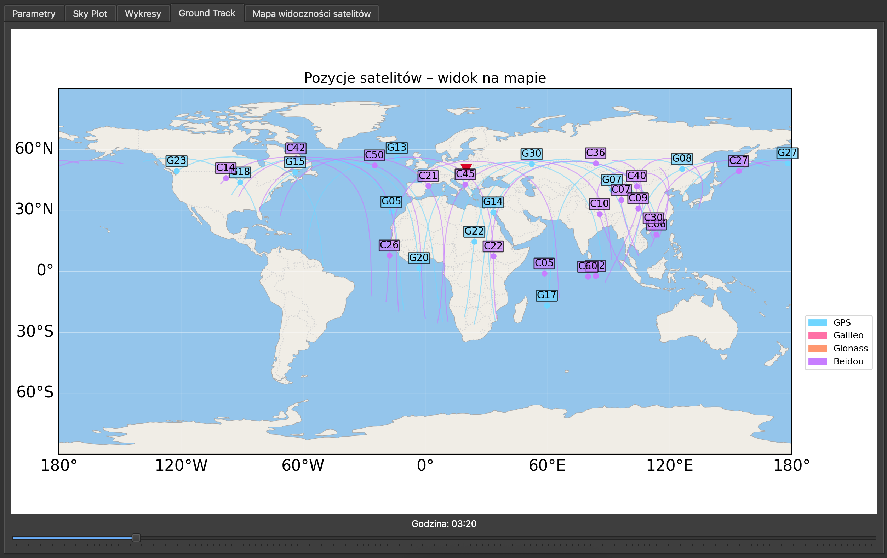

# Aplikacja GNSS – Analiza widoczności satelitów i wskaźników DOP

Aplikacja desktopowa umożliwiająca analizę widoczności satelitów GNSS (GPS, GLONASS, Galileo, BeiDou) oraz zmian współczynników DOP w ciągu doby, na podstawie danych z plików almanacha w formacie `.alm`.

---

## Funkcjonalności

- Obliczanie współczynników DOP (GDOP, PDOP, TDOP, HDOP, VDOP)
- Wizualizacja liczby widocznych satelitów GNSS w czasie
- Obliczanie trajektorii i pozycji satelitów w układzie ECEF
- Skyplot – rozmieszczenie satelitów na niebie
- Mapa zasięgu satelitów na świecie
- Obsługa systemów GNSS: **GPS, Galileo, GLONASS, BeiDou**
- Interfejs graficzny oparty na **PyQt6** i **matplotlib**

---

## Struktura projektu

| Plik              | Opis |
|----------------------|------|
| `main.py`            | Główna aplikacja Qt, kontrola GUI i logiki. |
| `charts.py`          | Wykresy i wizualizacje. |
| `sat_calc.py`        | Obliczenia pozycji satelitów. |
| `transformations.py` | Funkcje pomocnicze użyte do obliczeń |
| `alm_module.py`      | Funkcje pomocnicze użyte do obliczeń |

---

## Wymagania

- Python 3.10+
- `PyQt6`
- `matplotlib`
- `numpy`
- `pyproj`
- Pełna lista zależności znajduje się w pliku requirements.txt.

Instalacja zależności:

```bash
pip install -r requirements.txt

```

Uruchomienie

```bash
python main.py
```

## Przykładowe okna aplikacji




